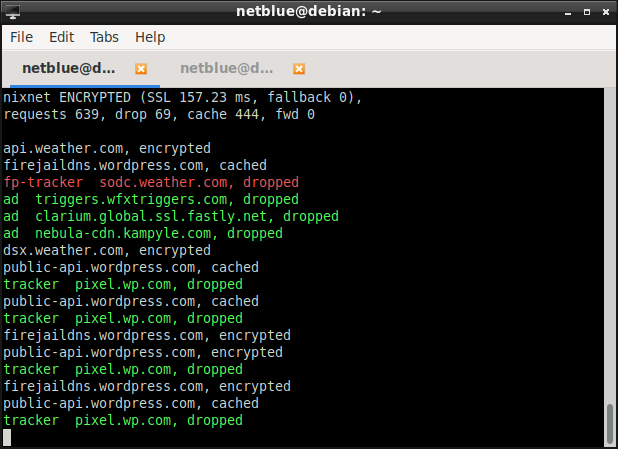

# Firejail DNS-over-HTTPS Proxy Server

&nbsp;

<a href="https://www.brighteon.com/e38d4f93-b147-4fa0-b941-cfd8f11bc628" target="_blank">
 HowTo</a>

&nbsp;

DNS over HTTPS (DoH) is a next-generation communication protocol on track on becoming a major Internet standard (<a href="https://datatracker.ietf.org/doc/rfc8484/">RFC 8484</a>). By adding strong encryption and authentication to the good old DNS protocol, DoH tries to eliminate some of the biggest problems DNS had from the beginning: censorship, surveillance, and man-in-the-middle attacks.

FDNS was designed to run as a local DoH proxy on a Linux desktop, or as a server for a small network. Lean and mean, it protects the computers against some of the most common cyber threats, all while improving the privacy and the system performance.

FDNS is written in C and licensed under GPLv3. The number one job is privacy. We use <b>only</b> DoH services from non-logging providers, while preferring small operators such as open-source enthusiasts and privacy-oriented non-profit organizations.

&nbsp;

<h2>Features</h2>
<ul>
<li>Works out of the box with little or no configuration changes.</li>
<li>Network of 100+ non-logging DoH service providers spread across the globe. Access to specialized services such as family filtering, adblocking, security, OpenNIC.</li>
<li><a href="https://en.wikipedia.org/wiki/DNS_over_TLS">DNS over TLS</a> support.</li>
<li>Blocking ads, first and third-party trackers, coinminers, etc. The filters are configurable, the user can add his own hosts filter.</li>
<li>DNS resolver cache and firewall: by default only A and AAAA queries are forwarded.</li>
<li>Conditional DNS forwarding support and whitelisting mode.</li>
<li>Regular DNS over UDP fallback in case the DoH service becomes unavailable.</li>
<li>Live DNS request monitoring and statistics.</li>
<li>Highly scalable multi-process design and built-in support for various security technologies: chroot, seccomp, Linux namespaces, and AppArmor.</li>
<li>Seamless integration with <a href="https://firejail.wordpress.com">Firejail Security Sandbox</a>.</li>
</ul>

&nbsp;

<h2>About us</h2>

&nbsp;

FDNS is a community project. We are not affiliated with any company, and we don’t have any commercial goals. Our focus is the Linux desktop. Home users and Linux beginners are our target market. The software is built by a large international team of volunteers on GitHub. Expert or regular Linux user, you are welcome to join us!

Security bugs are taken seriously, please email them to netblue30 at protonmail.com.

<ul>
<li>Webpage: <a href="https://firejaildns.wordpress.com">https://firejaildns.wordpress.com</a></li>
<li>Development: <a href="https://github.com/netblue30/fdns">https://github.com/netblue30/fdns</a></li>
<li>Documentation: <a href="https://github.com/netblue30/fdns/wiki">https://github.com/netblue30/fdns/wiki</a> (wiki)</li>
<li>Download: <a href="https://github.com/netblue30/fdns/releases">https://github.com/netblue30/fdns/releases</a></li>
<li>Support: <a href="https://github.com/netblue30/fdns/issues">https://github.com/netblue30/fdns/issues</a> (GitHub)
<li>FAQ: <a href="https://github.com/netblue30/fdns/wiki/FAQ">https://github.com/netblue30/fdns/wiki/FAQ</a> (wiki)</li>
</ul>

&nbsp;

